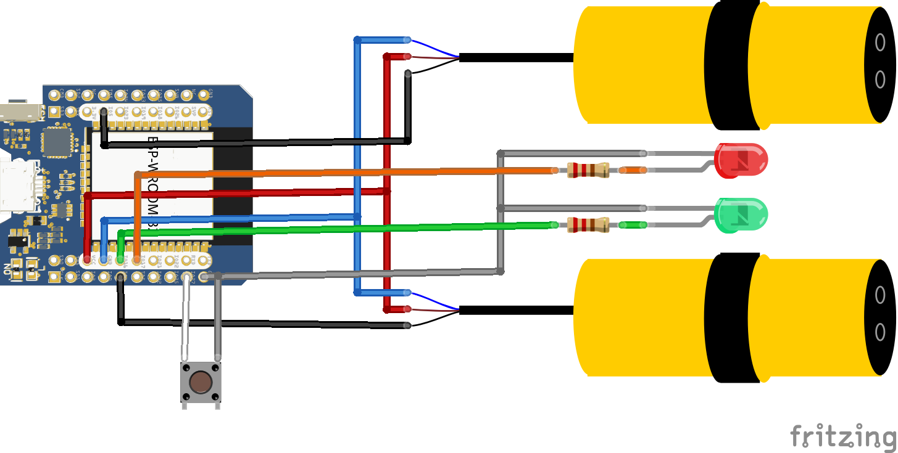
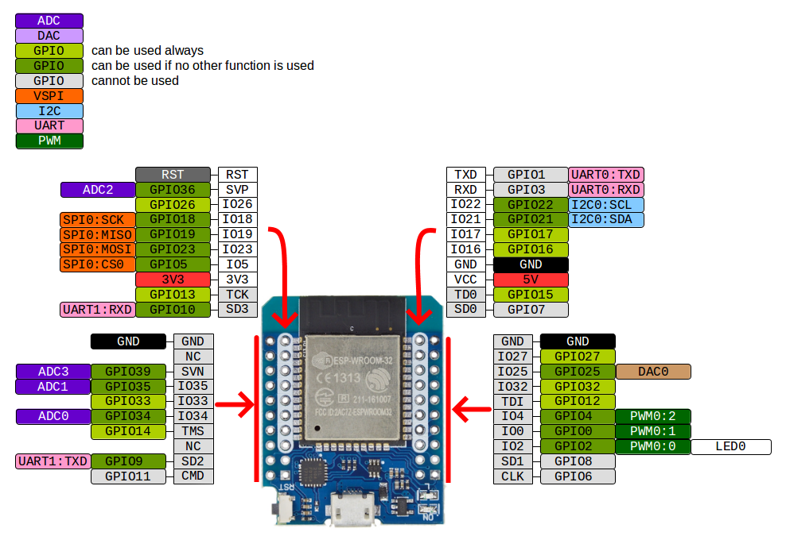
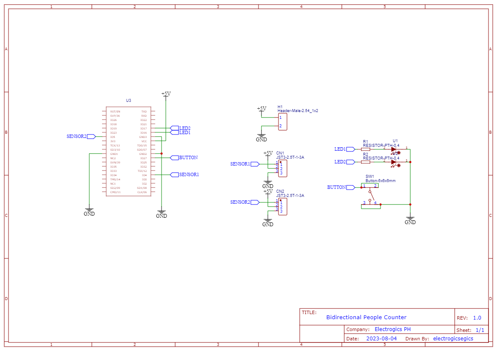
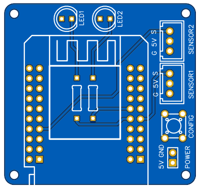
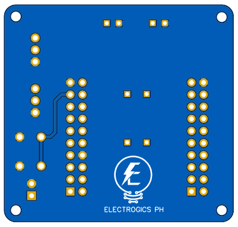
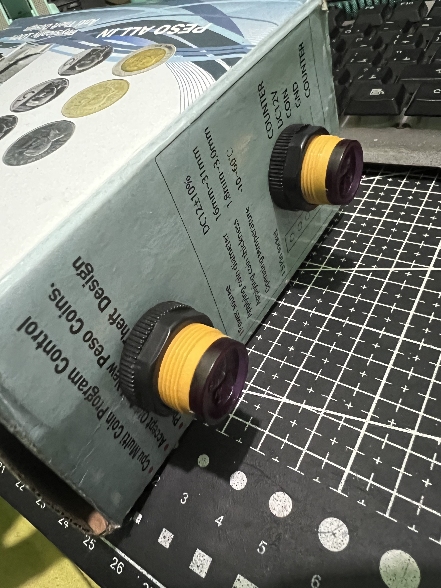

# bidirectional-people-counter
Count people entry and exit in a room

Hardware

* ESP32 wemos mini
* E1D80 IR sensors - detect object
* LED green - blinks when count increment
* LED red - blinks when count decrement
* Push Button - trigger config mode for wifi settings

### Wiring Diagram

ESP32 Pin out reference

### Schematic Diagram

### PCB
Top side

Bottom side

### Testing
Prototype 1
